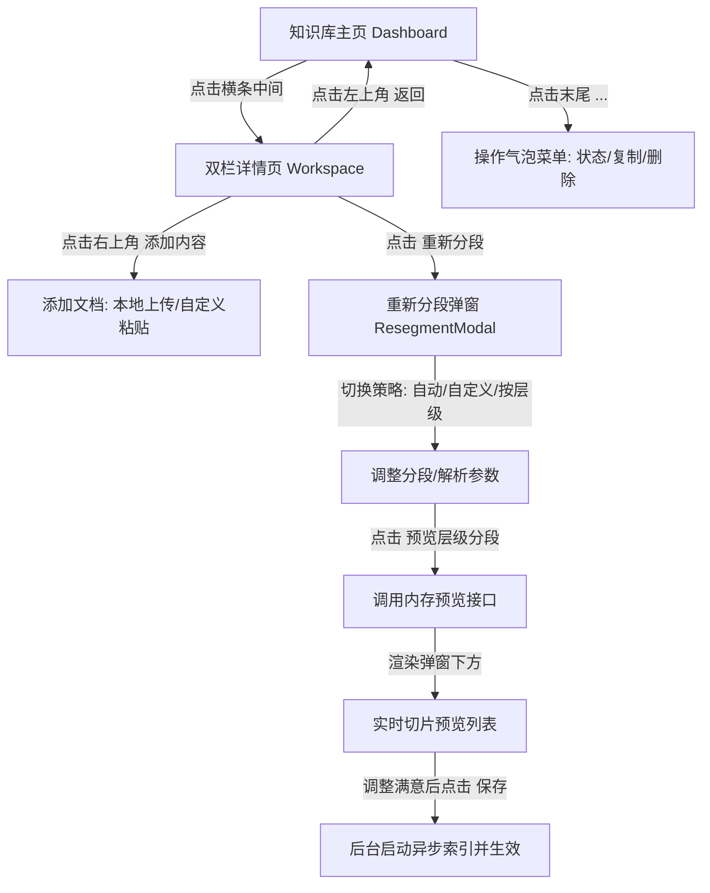

# Coze 风格知识库与层级分段系统设计规格说明书 (Spec)

本文档旨在详尽描述在 `langchain` (lingshu-agent) 项目中，重构知识库管理与展示功能的设计方案。我们将全面还原 Coze 风格的**资源列表 Dashboard**、**双栏文档管理工作台 Workspace**，并在此基础上，全新引入**“重新分段与层级切片预览”**的核心技术方案。

---

## 1. 系统业务交互流 (Business Interaction Flow)

系统的核心业务流包含“资源列表 Dashboard”、“详情工作台 Workspace” 以及 “重新分段与预览向导”：



### 1.1 资源列表 Dashboard 交互
* 用户进入“知识库”主导航时，默认加载。
* 每一个知识库以**横向卡片行（横条）**方式展示。
* 用户点击横条左侧及中间的主体区域，无缝进入该知识库的详情工作台。
* 横条末尾渲染三个点（`...`）按钮，点击后弹出操作下拉菜单：
  - **启用/禁用滑块**：控制该知识库是否对智能体 RAG 检索生效。
  - **复制到其他空间**：支持将该知识库复制到当前用户属于的其他 Workspace。
  - **删除**：确认删除知识库及所有关联文档与切片。

### 1.2 双栏详情页 Workspace 交互
* **左栏**：该库的文档列表（带关键字检索），展示文件名、分段数等基本信息。
* **右栏**：当前选中的文档详情与统计仪表盘（大小、分段数、命中数等）。主体区域为该文档已入库的 Chunks 卡片流，仅支持只读查看和检索，不支持直接双击修改文本内容。
* **添加内容下拉菜单**：点击右上角弹出，支持：
  - **本地文档**：上传支持的 TXT、MD、PDF、DOCX、CSV 文件，触发系统自动切片。
  - **自定义输入**：弹窗输入文件名与正文，点击直接导入并自动索引。
  - **外部通道 (Mock)**：WeChat、Notion、飞书等，统一做为 Coming Soon 预留。

### 1.3 重新分段与预览向导
* 点击右栏上方的 **“重新分段”** 按钮弹出。
* 用户可以自由切换解析模式（精准解析、快速解析）和分段策略（自动分段、自定义切片、按层级分段）。
* 切换为 **“按层级分段”** 时，显示分段层级（默认 3）和“检索切片保留层级信息”勾选框。悬停在 `?` 图标上显示层级树状结构图解。
* 点击 **“预览分段效果”** 按钮，弹窗自适应下滑展现列表，支持多轮调试。点击 **“保存并重新索引”** 真实提交入库。

---

## 2. 前端组件设计 (Frontend Architecture)

前端基于单页状态驱动（SPA），将在 `frontend/src/main.jsx` 中进行组件模块重构，避免污染全局结构。

```text
frontend/src/src
  ├── main.jsx (重构 KnowledgeHome，注入视图切换状态)
  ├── styles.css (全面优化 Coze 风格配色、滑块及悬浮弹窗样式)
```

### 2.1 新增与重构组件树
```text
KnowledgeHome (根容器)
 ├── KnowledgeDashboard (卡片资源列表视图)
 │    └── DropdownActionMenu (启用状态滑块 / 复制空间 / 危险红区删除)
 └── KnowledgeWorkspace (双栏文档详情工作台)
      ├── DocSidebar (文档检索列表，带 active 激活高亮)
      └── DocDetailMain (右侧指标看板与 Chunks 列表)
           ├── AddContentDropdown (悬浮添加内容：本地上传/自定义粘贴)
           └── ResegmentModal (重新分段核心配置弹窗)
                ├── HierarchyTooltip (层级结构自适应图解说明)
                └── PreviewPanel (内存预览切片结果面板)
```

---

## 3. 后端 API 接口定义 (API Endpoints)

为支持方案一的调参、预览和个性化持久化，扩展和新增以下 FastAPI 路由。

### 3.1 预览分段接口 (NEW)
* **路径**：`POST /api/knowledge-bases/{kb_id}/documents/{document_id}/preview`
* **权限**：Workspace 成员读权限
* **请求格式 (JSON)**：
```json
{
  "parse_mode": "precise",
  "segment_mode": "hierarchy",
  "delimiter": "##",
  "max_chunk_len": 5000,
  "overlap_pct": 10,
  "hierarchy_level": 3,
  "keep_hierarchy_info": true
}
```
* **逻辑**：读取 `document.text`，在内存中直接运行层级或自定义切片算法，不进行向量模型（Embedding）计算和数据库存储，零延迟返回数组。
* **返回格式**：
```json
{
  "chunks_count": 3,
  "preview_items": [
    {
      "chunk_index": 0,
      "text": "1. 一级标题\n这是属于一级标题之下的正文内容...",
      "hierarchy_path": "H1 > 1. 一级标题"
    },
    {
      "chunk_index": 1,
      "text": "2.1 二级标题\n由于分段层级设定 >= 2，这一段将被单独划分...",
      "hierarchy_path": "H1 > 1. 一级标题 > H2 > 2.1 二级标题"
    }
  ]
}
```

### 3.2 重新分段保存并索引接口 (NEW)
* **路径**：`POST /api/knowledge-bases/{kb_id}/documents/{document_id}/resegment`
* **权限**：Workspace 成员写权限
* **请求格式**：与预览接口的策略配置 JSON 一致。
* **逻辑**：
  1. 将该配置以字典字典更新到 `knowledge_documents.segment_config` 字段。
  2. 清理原有的 `knowledge_chunks` 数据库记录，并同步删除 Milvus/向量数据库中的向量索引（基于 document_id 过滤删除）。
  3. 读取配置，根据层级或参数重新执行切片，计算真实的 Embedding 并批量入库，更新文档状态为 `indexed`。
* **返回**：更新后的 `KnowledgeDocument` 实体 payload。

---

## 4. 数据库模型设计 (Database Schema)

在现有表结构之上进行安全地扩展，不干扰原有的 RAG 检索模型：

### 4.1 `knowledge_documents` (表模型扩展)
```python
class KnowledgeDocument(Base):
    __tablename__ = "knowledge_documents"

    id: Mapped[int] = mapped_column(Integer, primary_key=True)
    knowledge_base_id: Mapped[int] = mapped_column(ForeignKey("knowledge_bases.id", ondelete="CASCADE"), index=True)
    filename: Mapped[str] = mapped_column(String(255))
    title: Mapped[str] = mapped_column(String(255), default="")
    content_type: Mapped[str] = mapped_column(String(120))
    source_type: Mapped[str] = mapped_column(String(20), default="text")
    text: Mapped[str] = mapped_column(Text, default="")
    text_preview: Mapped[str] = mapped_column(Text, default="")
    chunk_count: Mapped[int] = mapped_column(Integer, default=0)
    error_message: Mapped[str] = mapped_column(Text, default="")
    status: Mapped[str] = mapped_column(String(20), default="uploaded")
    created_at: Mapped[datetime] = mapped_column(DateTime, default=now)
    updated_at: Mapped[datetime] = mapped_column(DateTime, default=now, onupdate=now)

    # ============= 新增配置扩展字段 =============
    segment_config: Mapped[dict | None] = mapped_column(JSON, nullable=True)
```

### 4.2 `knowledge_chunks` (切片树映射)
现有表结构已具备 `section` (存储层级面包屑描述，如 `H1 > 导论`) 和 `metadata_` 字段，可直接完美承载层级切片树，无需修改。
* `section`：存放面包屑格式的标题树结构 `'H1 > 一级标题 > H2 > 二级标题'`。
* `metadata_`：存放 `'hierarchy_path': ['H1', '一级标题', 'H2', '二级标题']`，检索时通过元数据保留并追溯上下文环境。

---

## 5. 层级分段算法逻辑 (Hierarchical Splitter)

后端重构 `core/services/knowledge.py` 的文本切分逻辑。当 `segment_mode == "hierarchy"` 时：

```python
def split_by_hierarchy(
    text: str,
    *,
    kb_id: int,
    document_id: int,
    max_level: int = 3,
    keep_hierarchy_info: bool = True
) -> list[dict]:
    """
    按 Markdown/文档标题层级进行树形切片划分。
    
    1. 使用正则匹配所有 H1(#), H2(##), H3(###) 标题结构。
    2. 基于标题在文本中的起始位置，将文章自适应划分为树形分支。
    3. 如果层级深度超过 max_level，则将底层叶子节点向下合并。
    4. 将每一个叶子正文切片构造成 Dict，其中：
       - section: 存放当前标题的面包屑结构
       - parent_id: 建立父子切片的指针引用
    """
    # 标题匹配规则
    heading_pattern = re.compile(r'^(#{1,6})\s+(.+)$', re.MULTILINE)
    matches = list(heading_pattern.finditer(text))
    
    if not matches:
        # 如果全篇无 Markdown 标题层级，自动退化为自定义字数自动切分
        return split_parent_child(text, kb_id=kb_id, document_id=document_id)
        
    # 根据标题切分正文段落，并将层级路径组装到 section 和元数据中
    # 构造类似于 {'parent_id': ..., 'chunk_id': ..., 'text': ..., 'section': 'H1 > 1 > H2 > 2.1'} 的数据格式并返回。
```

---

## 6. 开发实施与验证计划 (Phases & Verification)

我们将遵循渐进式迭代计划，并结合自动化与手动验证，确保 100% 的平稳交付。

### 6.1 开发阶段划分
1. **第一阶段 (基础结构重构)**：完成数据库 Model `segment_config` 的字段扩展；在 React 前端将单文件组件拆分为 SPA 的 `KnowledgeDashboard` 与 `KnowledgeWorkspace`，并跑通无缝路由切换。
2. **第二阶段 (添加内容与原位菜单)**：实现列表页的三个点 `...` 气泡下拉菜单 and 滑块开关；开发详情工作台右上角的上传和文本粘贴动态注入。
3. **第三阶段 (核心调参 modal 与实时预览)**：开发 `ResegmentModal`，完成层级说明 Tooltip，并编写后端预览 API `/preview` 及 `split_by_hierarchy` 深度切分逻辑。
4. **第四阶段 (完整集成保存与 RAG 检索联调)**：打通“确认重新索引”流程，验证基于自定义层级配置分段后，智能体 RAG 检索在携带和保留层级信息下的问答效果。

### 6.2 验证机制
* **单元测试**：针对 `split_by_hierarchy` 进行专门的测试（测试段落无标题的退化、测试超深三级层级的树形继承、测试重叠段大小）。
* **接口测试**：对 `/preview` 接口进行 Benchmark 测试，确保其在 20MB 超大文本预览时的响应延迟低于 200ms。
* **人工测试**：通过脑暴协同浏览器（Visual Companion）动态体验，人工校准滑块开关的交互延迟、菜单定位及层级树悬浮 Tooltip 出现的动效平稳度。
